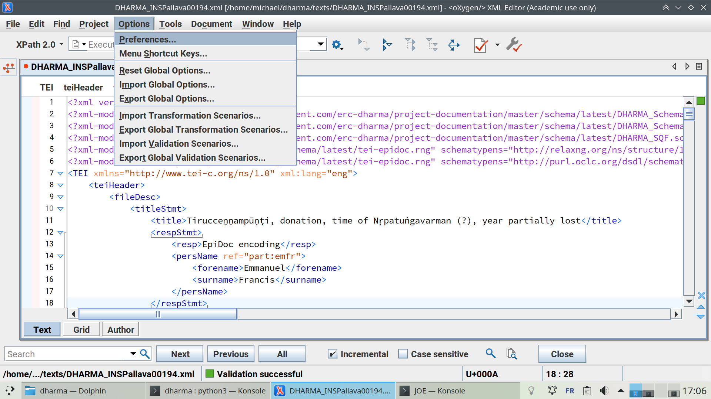
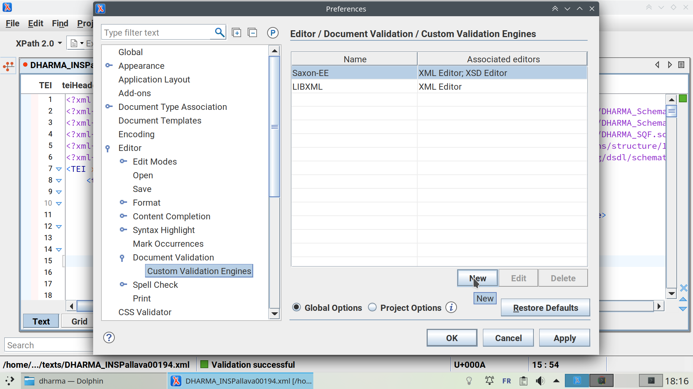
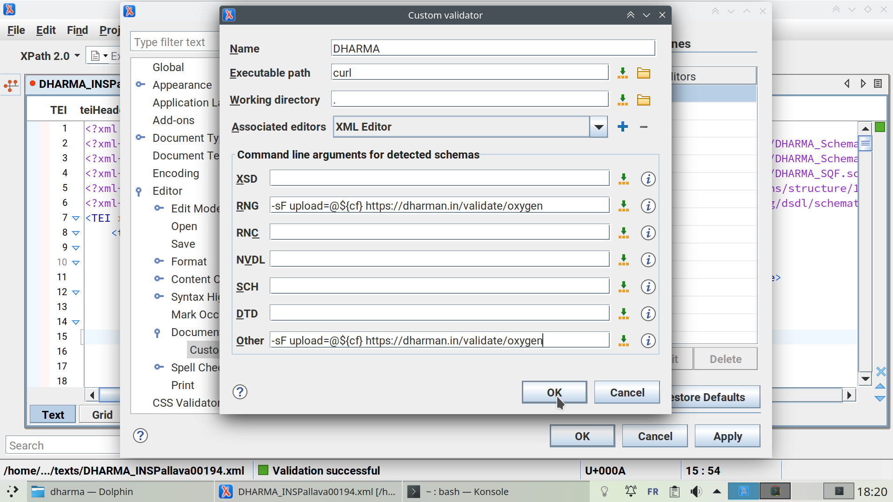
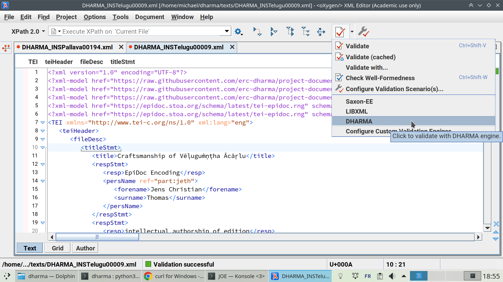
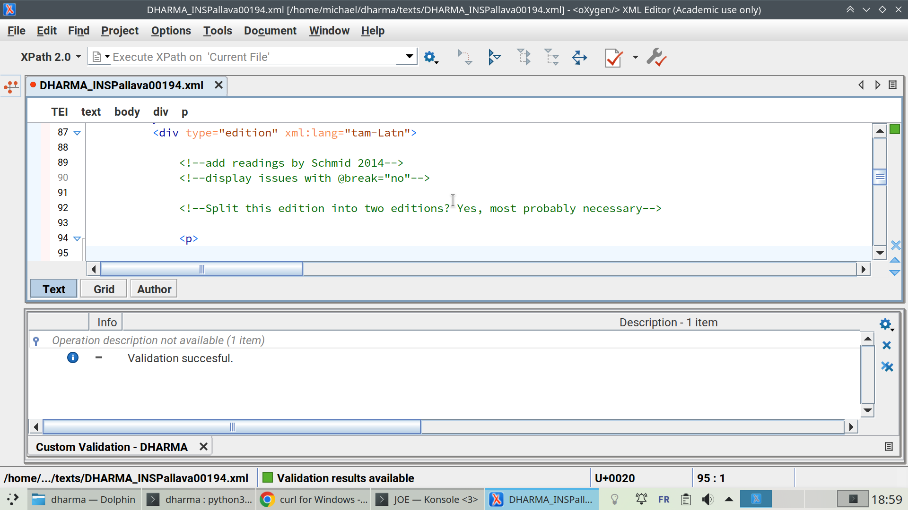
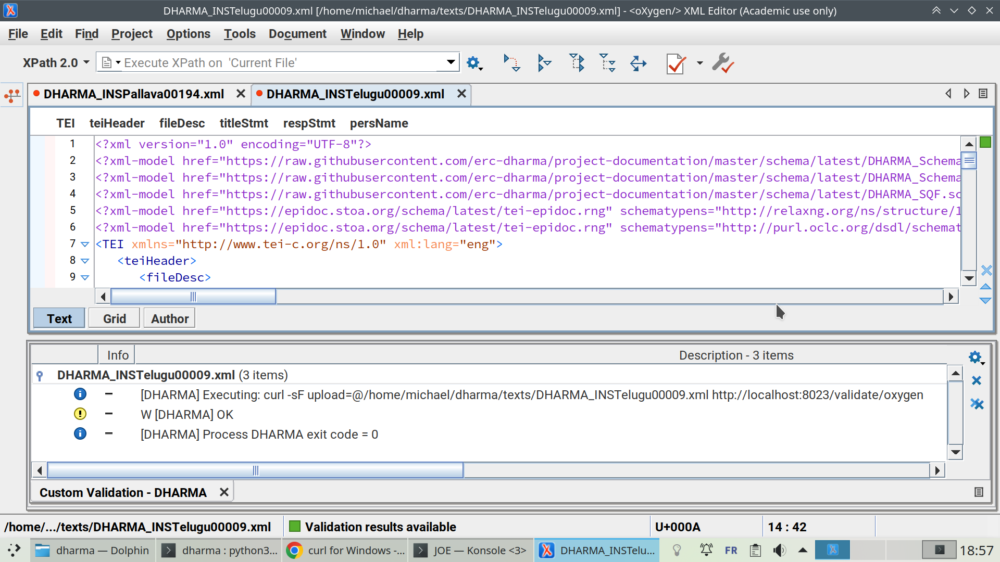
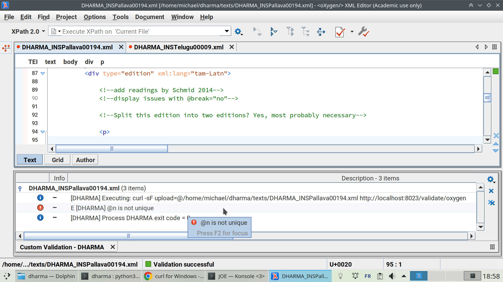

# More exhaustive validation in Oxygen

When you are editing files in Oxygen, they are validated automatically against
the DHARMA schema referenced in the file preamble. The schema location is given
in a processing instruction, for instance:

	<?xml-model href="https://raw.githubusercontent.com/erc-dharma/project-documentation/master/schema/latest/DHARMA_Schema.rng" type="application/xml" schematypens="http://relaxng.org/ns/structure/1.0"?>

The DHARMA schema verifies many things, but it is not complete and cannot be,
due to limitations of the format. Thus, in addition to the automatic validation
performed by Oxygen, you need to run from time to time an extra validation
step. This can be done from within Oxygen, as follows.

## Setup

In Oxygen, open the Preferences window with Option > Preferences:

In the left menu, navigate to Editor > Document Validation > Custom Validation
Engines. In the right part of the window, click on "New":

Fill the window as follows. (You can copy-paste the string `-sF upload=@${cf}
https://dharman.in/validate/oxygen` instead of typing it manually). Then click
OK:

If you are running MacOS, you are all set. On Windows, you might have to
install `curl`. Downloads are here: https://curl.se/windows. You most likely
should download the first item, "curl for 64-bit":

## Usage

Click on the downwards arrow next to the validation button in the toolbar, then
click on DHARMA in the popup menu. (The validation button might be located
somewhere else in your toolbar.)

If you see the following, or if the bottom window is not displayed at all,
there is an issue with your setup and your file was _not_ validated, despite
what Oxygen says. In this case, contact me to fix things:

If your file was properly processed and is valid, you should see the following.
Note the "OK" in the bottom window.

If your file was properly processed but presents some issues, you should see
something like this. Clicking on error messages in the bottom window brings you
to the location of the problem within the file:

Oxygen remembers the last validation engine you chose, so you can just click on
the validation button in the toolbar the next time you need to validate a file.
